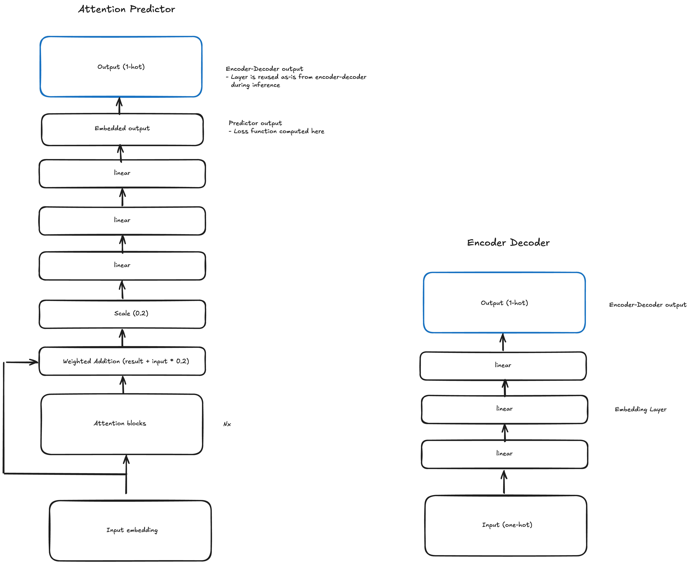

### Attention Predictor

A next-token prediction architecture featuring embedded input and output based on the attention mechanism.

**Architecture**

(Remember diagrams in AI are read from the bottom to the top for some unknown reason).



**Description**

**Features**

This model could be described as a simplistic decoder-only transformer.

It features

 - Multi-Head Attention.
 - Embedded output instead of one-hot dictionnary output.

**Work notes**

Things that helped with learning:
- Adding noise to the input.
- Repeating and shuffling lines of the corpus.

**Training corpus**

The model is trained on a corpus generated by a mix of LLMs, translation tools, manual input by me.

**Example output**


```
The bird|> is flying in the sea._The cat
The cat|> sat on the couch._The dog is
The dog|> sat on the couch._The dog is
The fish|> is swimming in the sea._The dog
A sailboat|> is sailing in the sea._The dog
A carrot|> is growing in the sea._The dog
```

Some issues so far:

 - It seems to be unable to learn the word garden and overfits on writing "sea" after "in the".
 - The training data says the cat is on the mat, not on the couch.
 - I have no concept of a stop token so far, that's why there is some of the next sentence at the end of these examples.

**Conclusion**
(section left empty because I'm still working on this model)

**What's next?**
(section left empty because I'm still working on this model)
