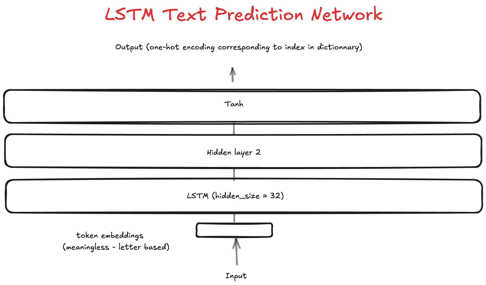

### Classic Neural Net Text Predictor

LSTM neural net to predict text tokens.

**Final structure**

(Remember diagrams in AI are read from the bottom to the top for some unknown reason).



**Description**

This model uses a lstm to predict the next value in a sequence of tokens.

**Features**

 - Worse than the previous approach (classic neural nets) [see here](./simple_predictor.md).

**Work notes**

 - Candle lstm examples online are quite difficult to find as of right now.
 - Candle's lstm implementation does not support metal GPU devices, so I had to train on CPU (slow).
 - My classic neural net, by comparison, was much simpler to create and had a much better ability to learn.
 - Presumably, I could have improved the architecture, but given these pain points and shortcomings of LSTM, I'd rather move on to other architectures like transformers.

**Training corpus**

The model is trained on the wikipedia article about [horses](https://en.wikipedia.org/wiki/Horse). It just knows how to spit out horse stuff, mostly copied from wikipedia.

**Example output**

```
Predicting next token for: '"Horses "'
Equus ferus caballus Equus ferus caballus Equus ferus caballus Equus ferus caballus Equus ferus caballus Equus ferus caballus Equus ferus caballus Equus ferus caballus Equus ferus caballus Equus ferus caballus Equus ferus caballus Equus ferus caballus Equus ferus caballus Equus ferus caballus Equus ferus caballus Equus ferus caballus Equus ferus caballus Equus ferus caballus Equus ferus caballus Equus ferus caballus Equus ferus caballus Equus ferus caballus Equus ferus caballus Equus ferus caballus Equus ferus caballus Equus ferus caballus Equus ferus caballus Equus ferus caballus Equus ferus caballus Equus ferus caballus Equus ferus caballus Equus ferus caballus Equus ferus caballus Equus ferus caballus Equus ferus caballus Equus ferus caballus Equus ferus caballus Equus ferus caballus Equus ferus caballus Equus ferus caballus Equus ferus caballus Equus ferus caballus Equus ferus caballus Equus ferus caballus Equus ferus caballus Equus ferus caballus Equus ferus caballus Equus ferus caballus Equus ferus caballus Equus ferus caballus Equus ferus caballus Equus ferus caballus Equus ferus caballus Equus ferus caballus Equus ferus caballus Equus ferus caballus Equus ferus caballus Equus ferus caballus Equus ferus caballus Equus ferus caballus Equus ferus caballus Equus ferus caballus Equus ferus caballus Equus ferus caballus Equus ferus caballus Equus ferus caballus Equus ferus caballus Equus ferus caballus Equus ferus caballus Equus ferus caballus Equus ferus caballus Equus ferus caballus Equus ferus caballus Equus ferus caballus Equus ferus caballus Equus ferus caballus Equus ferus caballus Equus ferus caballus Equus ferus caballus Equus ferus caballus Equus ferus caballus Equus ferus caballus Equus ferus caballus Equus ferus caballus Equus ferus caballus Equus ferus caballus Equus ferus caballus Equus ferus caballus Equus ferus caballus Equus ferus caballus Equus ferus caballus Equus ferus caballus Equus ferus caballus Equus ferus caballus Equus ferus caballus Equus ferus caballus Equus ferus caballus Equus
```

As you can see, the model has a bit of a repetition issue.

**Conclusion**

I'm not a fan of LSTM.

**What's next?**

Next, I wish to explore transformers, then post-transformer architectures. Stay tuned :slightly_smiling_face:
